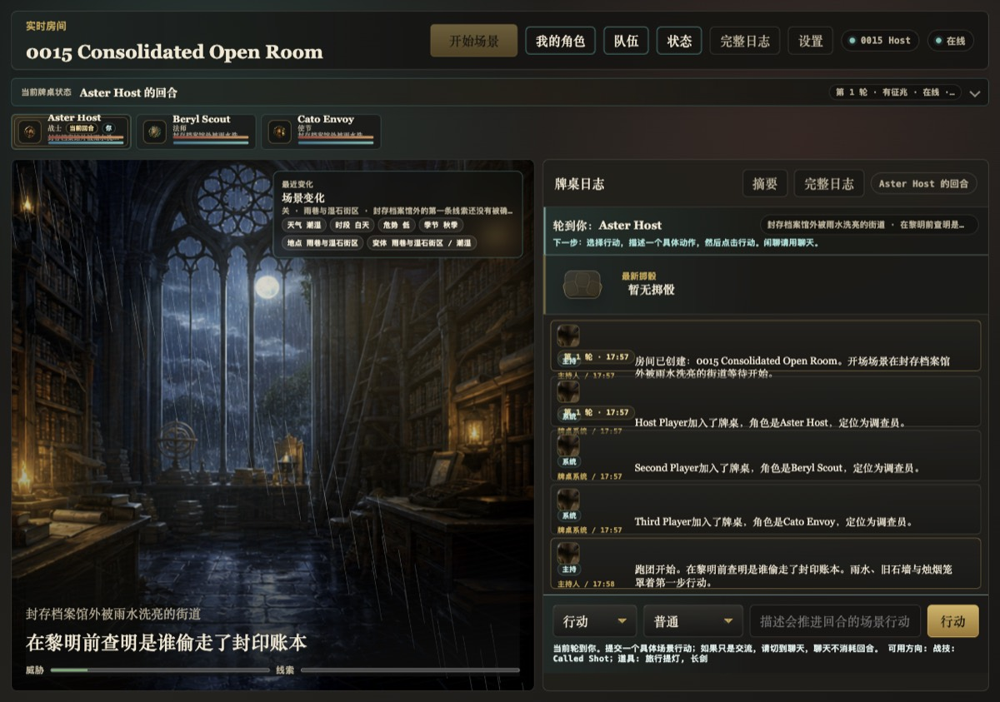
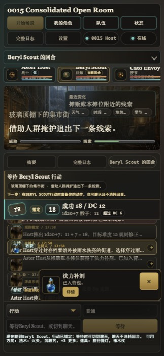
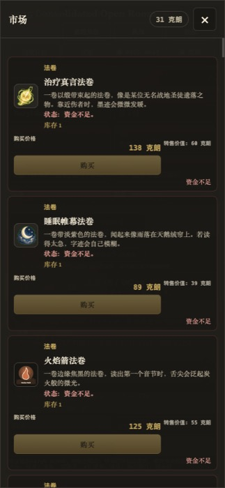

# AIDM

AIDM is a local-alpha AI tabletop game master for browser-based TRPG rooms. It combines a deterministic rules engine, room state, dice, memory, market/backpack loops, generated-asset mapping, ambience controls, and optional OpenAI narration into a playable web table.

The important boundary: AIDM is not a public hosted service yet. It is a local prototype with fail-closed public readiness gates.

## Screenshots

These screenshots are compressed from the current RC browser QA evidence. They are UI evidence only; generated game raster payloads under `assets/generated/` remain outside Git.

| Desktop table | Mobile table | Mobile market |
| --- | --- | --- |
|  |  |  |

Source evidence: `docs/qa/rc-browser-closure-2026-05-26.md`, with the curated GitHub screenshot set documented in `docs/screenshots/README.md`.

## What It Does

- Creates browser rooms for host-led or AI-assisted TRPG sessions.
- Supports open, password-protected, and host-approval local room flows.
- Runs a server-authoritative game loop for turns, dice, rules, HP, memory, inventory, market stock, and replay data.
- Uses deterministic local narration by default, so development and tests do not require paid AI calls.
- Can use OpenAI narration when `OPENAI_API_KEY` is configured.
- Streams room updates with Server-Sent Events for multiplayer sync.
- Provides player-facing drawers for character state, party, full log, market, backpack, ambience, TTS, and guide content.
- Keeps AI inside the narrative boundary: code owns turns, dice, state mutation, persistence, and gates.

## Run Locally

Prerequisite: Node.js 20 or newer.

```bash
npm run dev
```

Open:

```text
http://localhost:4173
```

The app has no package-install step today because it uses built-in Node/browser APIs and repo-local scripts. If `OPENAI_API_KEY` is absent, AIDM falls back to the deterministic local GM.

Optional environment:

```bash
OPENAI_API_KEY=... npm run dev
```

## Quality Gates

Useful local checks:

```bash
npm run test
npm run lint
npm run test:browser-qa
npm run eval:memory
npm run eval:memory:v1
npm run eval:memory:v2
npm run simulate:campaign
npm run smoke
npm run harness:check
```

Public readiness is deliberately stricter than local engineering quality. `npm run harness:check` is necessary for local review, but it does not approve public launch.

The public gate contract lives in `docs/RELEASE_GATES.md`. As of the current docs, the release gates for deployment, operations, security, legal/privacy, load, support, evidence indexing, and sign-off remain blocked until named evidence exists and Harness review accepts a gate change.

## Maturity

Current status:

- Local alpha: playable and testable on a developer machine.
- Not public beta: no production identity provider, production database, monitoring, support process, legal/privacy clearance, or real staging launch approval.
- Original generic fantasy prototype: not an official third-party rules, setting, lore, or asset service.
- Source-visible work in progress: no public license has been declared yet.

The maturity audit is tracked in `docs/MATURITY_AUDIT.md`; known product and launch gaps are tracked in `docs/BUGS.md`, `docs/GAP_ASSESSMENT.md`, and `docs/RELEASE_GATES.md`.

## Documentation Map

- `docs/USER_GUIDE.md`: player and host guide for the current browser table.
- `docs/ARCHITECTURE.md`: module map and deterministic AI boundary.
- `docs/TECH_STACK.md`: local stack decisions.
- `docs/PRODUCT_SCOPE.md`: product positioning and staged roadmap.
- `docs/ASSET_INVENTORY.md`: generated-asset inventory and player-safe surfaces.
- `docs/ASSET_PIPELINE.md`: asset generation and manifest workflow.
- `docs/RELEASE_GATES.md`: fail-closed public readiness gates.
- `docs/qa/`: browser QA, release evidence, and gate notes.

## Repository Notes

This repository is structured around a Harness workflow. Product changes are expected to start under `.harness/changes/<id>/`, pass review and test-report steps, and only then move through development branch review.

Generated image payloads are intentionally kept out of normal Git tracking. Use the manifest and docs to review asset coverage; do not treat missing `assets/generated/**/*.png` files in a clean clone as a public launch approval.
