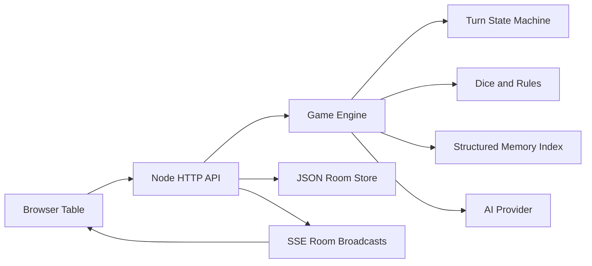

# Architecture

## Core Modules

- `src/core/dice.js`: parses and rolls dice formulas such as `1d20+2`.
- `src/core/stateMachine.js`: creates turn order, enforces active player, advances rounds.
- `src/core/memory.js`: stores flat memories plus structured campaign memory layers for timeline beats, quest threads, NPC facts, open clues, and scene anchors. Retrieval is deterministic term overlap with recency and salience boosts; AI narration consumes retrieved entries but does not write memory directly.
- `src/core/aiProvider.js`: switches between OpenAI and deterministic local narration.
- `src/core/gameEngine.js`: applies player actions and records transcript/memory.
- `src/core/storage.js`: persists rooms to disk.
- `src/server/server.js`: HTTP routes, static files, and SSE.

## Deterministic Boundary

The AI provider only writes narrative text. It does not decide whose turn it is, roll dice, mutate HP, or persist memory. This keeps the product debuggable and testable.
